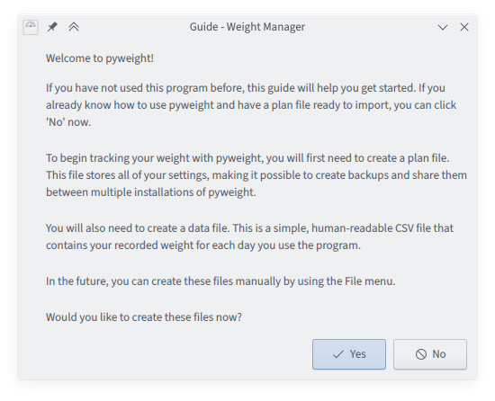
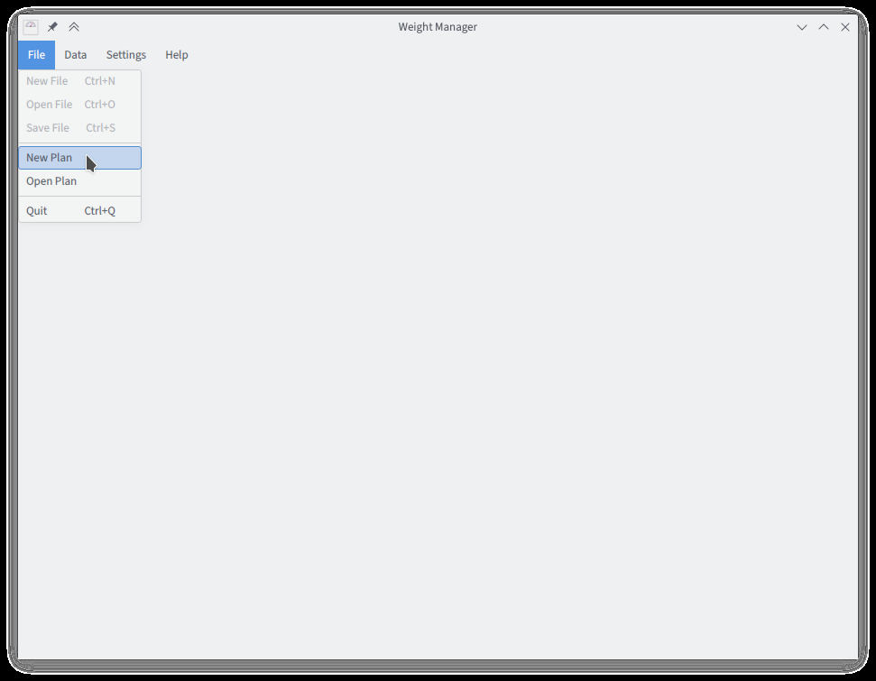
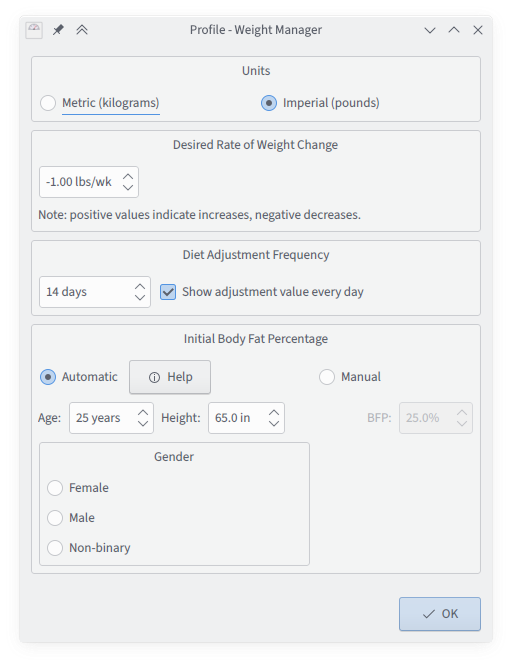
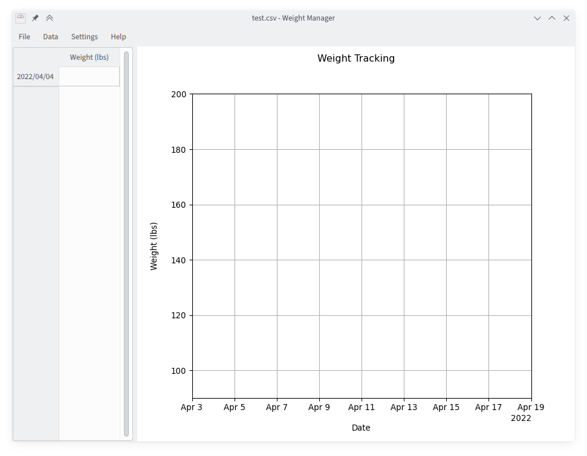
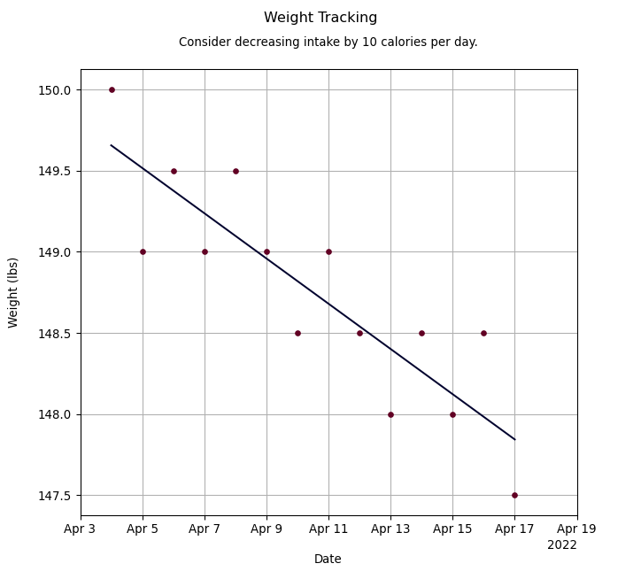
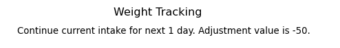
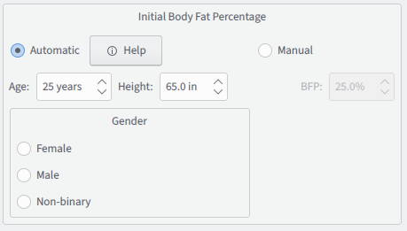
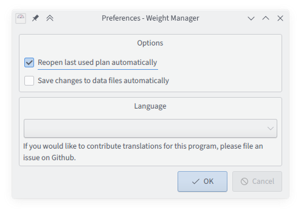

# Guide to Using PyWeight

Using PyWeight is easy! Read this document to learn more about basic
PyWeight operations.

## Getting started

The first time you start PyWeight, you should be greeted by the
built-in Guide. This window provides you with basic information about
PyWeight, and will have you perform the necessary setup automatically.

PyWeight needs to create two files to store your data. One of these
is a **plan file**, and contains personal information about you,
including your height, age, and gender. PyWeight uses this
information in order to provide more accurate advice to you about how
to adjust your calorie intake. PyWeight is an entirely offline and
open source application, so you can be assured that this data is not
sent to anyone, even the developers of PyWeight.

If you click "No" at the guide prompt, or ever need to create a new
**plan**, you can do so from the program's File menu.

When you create a new **plan**, you will be prompted to save a file,
with the extension `.wmplan`. With PyWeight's default settings, you
won't need to remember where you saved this file because it will be
opened for you automatically in the future. However, you may want
to keep it somewhere you'll remember so you can create backups.

After saving your plan file you will be prompted to change your plan
settings. You can always change these settings in the future with the
"Plan Settings" option under the "Settings" menu.

Most of these options are intended to be self-explanatory. For more
details on editing your **plan**, see the [plan section](#Plans) of
this document.

If you're following the guide, after creating a **plan** file, you'll
be prompted to also create a **data** file. This file is a simple CSV
file that tracks your weight over time. It is kept separate from the
plan file so that you can easily import it into other programs or
spreadsheet applications, or back it up separately.

**Note:** the **data** file always uses kilograms as its weight unit,
no matter what you set in your **plan**. This is so that you can
switch from one unit to the other as often as you like, without
rounding errors building up in the file over time. It also means that
the format of the **data** file can be completely independent of its
associated plan.

## Basic Usage

Once you have created your **plan** and **data** files, you're ready
to begin using PyWeight!

Let's take a moment to get used to the PyWeight main window. The
window is separated into two panes. The first of these, on the left,
contains a table that you will use to enter your weight.

The PyWeight weight management concept revolves around weighing
yourself every day, so the interface is built around the assumption
that you will do this. PyWeight will continue to work if you
occasionally miss a day, but some other program would likely serve
your needs better if you plan to only record your weight on a weekly
basis. For the reasoning behind this behavior, see the
[Technical Concepts](Technical%20Concepts.html) page or the
associated
[blog post](https://adamfontenot.com/post/statistics-assisted_weight_loss_with_pyweight).

You use PyWeight by entering your weight regularly in the left
pane. Anything you enter will be automatically added to the graph in
the right pane. When you add or change a weight entry, you can save
your changes to the underlying data file by clicking "Save File" in
the "File" menu, or by pressing Ctrl-S. The program will also prompt
you to save any unsaved data when you quit. When a **data** file has
been edited, this is indicated by an asterisk `*` after the file name
in the program window title. An option to save changes to your data
files automatically is available in the PyWeight
[Settings](#Settings).

Normally, PyWeight will automatically create blank weight entries
for you. This happens whenever you add an entry, or when you restart
the program. In some cases --- for example, if you leave the program
open and forget to record your weight for several days --- you might
want to trigger the creation of new entries. You can do this with
the "Refresh" option under the "Data" menu item, or by pressing
Ctrl-R.

When creating your **plan**, you set a frequency for the program's
diet adjustment advice. After this many days have passed since your
first weight entry, PyWeight will give you advice that indicates
how closely you have adhered to your diet.

In this example, the user has adhered quite closely to their intended
diet, and so PyWeight suggests a change of only 10 calories per day.
Such a value is small enough that no significant changes to one's meal
plan would be called for. A larger difference, of 100 calories a day
or more, would suggest a tweak is needed.

Notice that the program has drawn a straight line through the data,
indicating what it estimates as the true weight of the user on each
date. Such an estimate is usually much more accurate than what the
scale said on that day (and you recorded), because it ignores the
large swings caused by changes in water weight and variations in meal
size.

If the program has suggested you make a change, and you modify your
calorie intake, it wouldn't make sense to continue the straight line
from the previous period of your diet. If you eat less than before,
we should expect your rate of weight loss to increase. Therefore
PyWeight will begin a new linear segment for the diet every time it
suggests an adjustment. Each new segment has an extra constraint: it
is forced to be continuous with each preceding segment. See the
[Technical Concepts](Technical%20Concepts.html) page for more about
this.

Whenever you want to change the rate at which you are gaining or
losing weight (for example, if you achieve your goal weight and need
to begin maintaining), you can do so in your [plan settings](#Plans).

## Plans

Let's take a closer look at the options for weight management plans.

To edit the settings for an existing **plan**, click "Plan Settings"
under the "Settings" menu. Settings you change in this window will
not be saved or applied to your plan until you click "Apply" or "OK".

### Units

You can change your preferred units in PyWeight at any time. Changes
to units are lossless, meaning that they don't cause rounding errors
during the conversion from one unit to another.

When you change the units option in the plan settings window, the
units displayed for other settings in the window will be converted
automatically for your convenience. Even though these values
automatically change, the changes are still not applied until you
click "OK" or "Apply".

### Desired Rate of Weight Change

You can enter the rate at which you want to change your weight in
this box. Notice that a negative value, such as the default of
"-1 lbs/week", indicates losing weight. A positive value would tell
the program that you want to gain weight. Of course, should you want
to maintain your current weight, you can simply enter 0 here.

The unmodified program will not allow you to enter clearly
unreasonable rates of weight change (no more than 3 pounds per week).
Note that just because the PyWeight allows you to enter a value, it
is not thereby endorsing your goal as reasonable for you or healthy
for anyone. It is up to you, in consultation with a doctor, to come
up with a reasonable target.

### Diet Adjustment Frequency

Here you can select how often you want PyWeight to provide you with
advice on modifying your diet to hit your weight management target.
Values from 7 to 30 days are selectable; values from 14 to 21 days
are recommended. In general, the slower you are trying to lose
weight, the longer your dieting periods should be.

You can also choose whether or not to show the adjustment value
every day --- as opposed to only on the diet adjustment day. The
displayed adjustment value is the advice that the program *would*
provide, if today was a scheduled adjustment day.

This option is provided because not being able to see how you are
doing could easily prove more annoying than helpful. However, as
indicated by the advice text, you should *not* use the adjustment
value to make changes to your meal plans except on the designated
adjustment day. This is because the program is built around the
assumption that your weight will change at a linear rate, making
a simple linear regression a reasonable approach for estimating
your true weight loss over time. See the
[Technical Concepts](Technical%20Concepts.html) page for more.

In this example, the user is currently estimated to have eaten about
50 calories too much each day. However, they are instructed to
continue with their current meal plan (actual or estimated) for one
more day, until the end of the current adjustment period.

### Initial Body Fat Percentage

This is the most complicated of the **plan** settings. PyWeight uses
the values provided to calculate the energy density of the weight you
lose (or gain) and from that the difference between the number of
calories you ate and the number needed to hit your goal.

If possible, you should select "Manual" mode and enter your true body
fat percentage. This value should be provided from an accurate
medical procedure such as a DEXA scan or body density measurement
from underwater weighing. At home measurements with electrostatic
devices are likely to be highly inaccurate and using the automatic
mode is preferred if this is all you have available.

The automatic mode will attempt to estimate your body fat percentage
at the start of your diet using your age, height, and gender. (Your
starting weight is also a factor, of course, but this is determined
from your entered data.) This is less accurate than manual mode, but
still much better than assuming the same value for everyone.

Age and height are self-explanatory. The gender option is a little
bit more sophisticated.

The authors of PyWeight reviewed the available medical literature on
estimation of body fat, and found it lacking in several respects. In
particular, many published formulae were not well-studied across
different races and no formula we could find looked at body fat in
transgender, non-binary, or intersex individuals.

Publishing the program with a strict binary as the only option is
unacceptable to the authors, and so we have made the following
compromise: users who wish may choose a "non-binary" option and
select a position on a range from female to male. The program will
treat their body as being a weighted average of female and male
bodies. This should not be understood as a reflection of the
individual's gender identity but rather as simply a flawed
approximation of how their body might behave during weight changes.

The result is clearly suboptimal, but we believe we have made the
best compromise possible in view of the state of the literature.
Users who have additional recommendations or can point to relevant
research are welcomed to file an issue.

If no gender is selected, PyWeight will treat the user as an
average of the male and female options.

## Settings

PyWeight has several settings (independent of the settings for your
weight management plan) that can be adjusted. These settings are
available by clicking "PyWeight Settings" under the "Settings" menu.

Here you can choose whether your last used **plan** file is reopened
automatically.

You can also choose whether changes made to your data files (such as
adding a new weight entry) are automatically saved. You can always
save your changes using the File menu.

The PyWeight settings also contain an option to set the program
language. As of this writing, this function is inoperative, as no
translations have yet been provided for the program. If you are able
to translate PyWeight into another language, please create an issue.

## Exporting your data

Because your data file is a simple CSV, you can copy and use it
directly in any other program that supports the same format, or
easily import the data into a spreadsheet.

You can export your weight tracking graph to other formats using the
Export option under the "Data" menu. Your graph can be saved as a
PNG, SVG, or PDF file. The file type will be determined automatically
on the basis of which extension you use.
