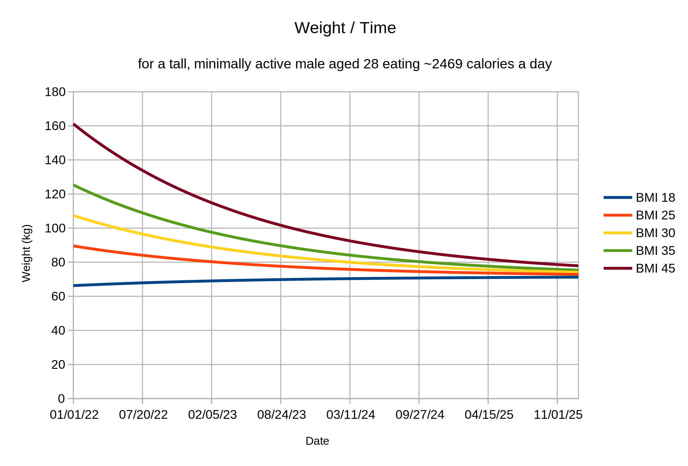

# PyWeight Technical Concepts

This document explains the theoretical background for the PyWeight
application. Ordinary users are not expected to need to read this.

Users who wish to read a light overview of the ideas here and a
discussion of weight loss using PyWeight may find the
[essay]()
by PyWeight's primary author informative.

## How PyWeight works

PyWeight is intended to make weight management easier by solving two
problems:

 * Fluctuations in body weight tend to swamp real changes on a daily
   basis, making it difficult to track progress
 
 * Determining a meal plan on the basis of calories in - calories out
   (CICO) is difficult, because determining your total daily energy
   expenditure (TDEE) is hard, and accurately counting every calorie
   you eat is arguably even harder.

The method employed by PyWeight involves estimating the rate of
weight loss (in kg/day) by taking the derivative of statistically
smoothed daily measurements. This basic idea was originally suggested
by [The Hacker's Diet](https://www.fourmilab.ch/hackdiet/), though
PyWeight contains a number of improvements.

For a given period of $d$ days, if the weight loss goal was $g$
kilograms and the actual weight loss was $w$ kilograms, then the
difference between the goal and the actual change is $(g - w) / d$,
in kilograms per day.

This approach not only gets rid of most fluctuations (by taking the
derivative of a smoothed value), it also determines the degree of
success and failure independently of any knowledge about meal
planning. It simply answers the question "did the user lose too much
weight, or not enough?".

However, telling the user "try to lose 0.01 more kilograms every day"
is not useful advice. Regardless of whether or not the user is
precisely planning meals, "try to eat 75 fewer calories every day" is
far more actionable, because it translates in a straightforward way
to actual meal-time decisions.

Therefore, PyWeight needs to estimate how many calories are
associated with a given quantity of weight loss. If we can calculate
the size of the calorie deficit required to lose $g$ kilograms, and
the size of the deficit required to lose $w$ kilograms, then we can
trivially calculate the number of calories the user missed their
target by over the $d$ day period, and therefore how many calories
they missed their target by on a daily basis.

The constraint this program works under is that this calculation has
to be made without reference to meal plans or knowledge of the user's
TDEE. The rest of this document details how to do that.

## Simplifications

Changes in weight are the result of a deficit or surplus in energy
intake to energy expended by the body. The body releases energy for
use in its activities by breaking down the chemical bonds in several
molecules. These molecules can either come from food and substances
like glycogen created by the body from food, or they can come from
energy stored in the body, mostly as fatty acids.

If we assume a constant energy expenditure, then a long term
reduction in daily food intake of 100 calories will mean that the
body will have to take that 100 calories from its energy storage.
The byproducts of the body's energy creation process, largely
carbon dioxide and water, will be expelled into the environment,
reducing the amount of mass the body permanently stores.

This suggests a straightforward way of determining the size of the
deficit required to lose a kilogram of mass. If an individual eats
$n$ fewer calories than their body consumes over a period of time,
those $n$ calories will necessarily (by conservation of energy) be
taken from its energy stores instead. If these energy stores are in
the form of fat tissue, we can determine the expected amount of
weight loss associated with the deficit using the typical energy
density of fat tissue. No information about the individual or their
diet is required.

Because of the obvious usefulness of such a simplification, it is
unsurprising that the claim that a pound of fat contains 3500
calories has become a piece of common "knowledge". If this is true,
then *any* person who wants to lose 50 pounds needs to achieve a
total deficit of 175,000 calories. They will therefore lose this 50
pounds via any method of achieving this deficit, whether it takes
weeks, months, or years.

Unfortunately, this commonly held belief is wrong: a pound of fat
contains about 4280 calories (just over 9400 calories per 
kilogram).[^1] Obviously, fixing the incorrect value would not be too
difficult, but the apparent straightforwardness of this approach
masks two crucial assumptions:

 * The individual attempting to lose weight will have a constant
   energy expenditure over the course of the diet.

 * The weight lost over the course of the diet will be entirely from
   the fat the body uses for energy.

Both of these assumptions are incorrect, and so we need to think
about the implications for the determination of caloric deficits and
dietary strategy.

## Changing energy needs over the course of a diet

It is easy to see that the assumption of a constant energy
requirement is incorrect. A person who weighs 150 kilograms will need
more energy than one who weighs 100 kilograms, simply in virtue of
needing to expend more energy to move the extra 50 kilograms from
point A to point B, and because those 50 kilograms contain cells 
which need energy to sustain themselves. Published equations for
basal metabolic response, and therefore also for TDEE, rely on body
weight, height, and other characteristics. Since one's weight changes
over the course of a diet, one's energy requirements will also.

For some common estimates of basal metabolic response, such as the
Mifflin - St. Jeor equation, energy needs are linear with body
weight. If true, this is convenient because it suggests that one's
weight over time follows a simple first order differential equation.

Assuming the Mifflin - St. Jeor equation accurately describes the
behavior of metabolism, weight over time is:

$$\frac{\mathit{dx}}{\mathit{dt}} = \frac{intake + activity\left(b - 10 x\right)}{7700}$$

where $b$ is the constant

$$b = 6.25 \mathit{height} - 5 \mathit{age} + 166 \mathit{sex} - 161$$

Here, $\mathit{intake}$ is the daily calories
consumed, $\mathit{activity}$ is a multiplier indicating the level of activity
relative to the BMR (e.g. 1.4 indicates a fairly inactive adult), and
sex is 0 for women and 1 for men. Units are calories, centimeters,
and years. Note that the 7700 value reflects the expected energy
density of weight loss: the assumption made here is the metric
equivalent of 3500 calories per pound.

Solving this equation suggests that someone who eats like a
metabolically identical person with their goal weight will
exponentially approach that weight.

Unfortunately, while it makes for a nice graph, the assumption that
the energy expenditure of dieters varies linearly with their current
weight is also false, according to research.

Rather, metabolism has two transitory effects, one immediate and the
other long lasting. Both resist *changes* in weight, whether
increases or decreases.

When someone begins eating at a calorie deficit, the body responds by
reducing the amount of energy it consumes. (Despite the way this
happens in the popular imagination, the effect is not magical. Their
body is simply doing less work than it did before. Someone eating at
a deficit is likely to be more tired than normal, feel less like
exercising, and some of their body's regular processes may be
disrupted.) Thus, even if published equations accurately estimate an
individual's TDEE, the estimate will (temporarily) become inaccurate
while they are trying to lose weight.

Similarly, the body may behave as though it remembered its previous
weight (lower or higher) and was trying to get back to that. The
NIDDK model of diet performance suggests that someone who is 235 lbs,
having recently gained 85 pounds will consume about 400 more calories
per day than an otherwise metabolically equivalent individual of the
same weight who recently lost 85 pounds.[^2] [^3]

This effect is partially explained by differences in body
composition. Lean body mass requires more energy to maintain than
does fat. But there may also be some active component, whereby the
body reduces its metabolic rate following weight loss more than can
be explained by changes in body composition.

The existence of this effect --- at all --- is contentious. Some
studies found no such effect.[^4]

We suggest that while such an effect may make sense both
physiologically and in terms of selective pressure, it is likely to
be temporary. The NIDDK model shows a much larger effect for gaining
weight than it does for losing weight. There is only a 50 calorie a
day difference in that model between the 235 pound person mentioned
above who lost 85 pounds and someone who has maintained at 235 pounds
for years, while the person who gained 85 pounds burns 350 calories
a day more. But few 235 pound people have weighed that much their
entire adult lives: you only become someone who maintains at 235
pounds by previously weighing much less and gaining weight. In other
words, transitioning between these profiles must be possible, though
it may take more time than the typical study length of the research
used in developing this model.

PyWeight takes a very interesting approach to these complexities,
which also happens to be the simplest one: we completely ignore them.

If our approach involved trying to determine the user's TDEE in order
to provide them with a recommended number of calories to consume, we
would have to take all this into account. However, we don't do this.
The PyWeight approach is to determine the *difference* between the
user's caloric target and their intake. Metabolism obviously has a
direct effect on the number of calories required to maintain one's
weight, but it has an almost negligible effect on the energy density
of given unit of weight loss.

## The composition of weight loss

Above, we discussed the naive claims that body composition
changes are entirely in the amount of fat retained, and that this fat
has an energy density of 3500 calories.

As it turns out, while both of these claims in incorrect, their
effects point in opposite directions and therefore 3500 calories / 
pound is a more reasonable estimate than expected. As it turns out,
the lean body mass lost during weight reduction has a typical density
of about 824 calories a pound[^1], and therefore the 3500 calorie
per pound estimate is almost exactly right if about 75% of the weight
you lose is from fat.

That said, such an estimate clearly can't be right in many cases. If
we imagine someone slightly underweight continuing to lose weight,
they will at some point have no more fat to lose, and will therefore
lose lean mass instead. We should expect the fraction of weight loss
due to fat to be a continuous function, approaching 0 for
individuals for very little fat mass, and approaching some high
fraction (though not 1) for individuals with a large amount of fat
losing a comparatively small amount of weight.

Hall[^5] and Hall et. al[^6] provide a model describing the
behavior of this ratio, and it is this model on which PyWeight's
calculation of weight loss composition is based.

The Hall paper takes an equation from Forbes[^7]:

$$L = 10.4 \ln F + 14.2$$

Looking at this equation, we can see that it suggests a static
relationship between fat mass $F$ and lean mass
$L$. An individual described by this equation with only
one kilogram of fat would have 14.2 kilograms of fat free mass. Such
an equation clearly could not describe everyone. Forbes' equation was
an empirical fit to a number of physically similar women.

Hall effectively conjectures that this relationship extends to other
body types as well, satisfying the equation

$$L = 10.4 \ln F + A$$

for a constant $A$ specific to each body type. 

If we let $L_i$, $L_f$, and
$F_i$, $F_f$ describe the body's lean and fat masses before
and after weight loss (respectively), then since by definition
$L_f = L_i + \Delta L$,

$$10.4 \ln{F_f} + A = 10.4 \ln{F_i} + A + \Delta L$$

and the $A$ on each side of the equation conveniently drops out. At
first glance this equation doesn't seem to have simplified things,
but notice that $\Delta L$ is just the portion of total
change in mass not attributable to change in fat mass:

$$\Delta L = \Delta M - \Delta F$$

We make that substitution and isolate $F_f$.

$$
\begin{align*}
10.4 \ln{F_f} &= 10.4 \ln{F_i} + \Delta M - \left(F_f - F_i\right)
\\\\
F_f &= \exp{\left(\frac{10.4 \ln{F_i} + \Delta M + F_i - F_f}{10.4}\right)}
\\
  &= \exp{\left(\ln{F_i} + \frac{\Delta M}{10.4} + \frac{F_i}{10.4} - \frac{F_f}{10.4}\right)}
\\
  &= F_i \exp{\left(\frac{F_i}{10.4}\right)} \exp{\left(\frac{\Delta M}{10.4}\right)} / \exp{\left(\frac{F_f}{10.4}\right)}
\\\\
F_f \exp\left(\frac{F_f}{10.4}\right) &= F_i \exp\left(\frac{F_i}{10.4}\right) \exp\left(\frac{\Delta M}{10.4}\right)
\end{align*}
$$

Making the substitution $F_f = 10.4 u$,

$$u \exp(u) = \frac{1}{10.4}\left(\ldots\right)$$

For positive $u$, equations of the form $u\exp(u) = v$ have the
unique solution $u = \mathop{\mathrm{W_0}}\left(v\right)$, where
$\mathop{\mathrm{W}}$ is the Lambert $\mathop{\mathrm{W}}$ function.
Back-substituting,

$$F_f = 10.4 \mathop{\mathrm{W_0}}\left(\frac{F_i}{10.4} \exp\left(\frac{F_i}{10.4}\right) \exp\left(\frac{\Delta M}{10.4}\right)\right)$$

Hall et. al looked at studies of weight loss and found that this
equation does accurately describe relative changes in fat and lean
mass in a wide variety of body types.

We know that $F_i = \mathit{BFP_i} \cdot \mathit{M_i}$ where 
$\mathit{BFP_i}$ designates the initial
body fat percentage. This is something we can estimate on the basis
of other variables (see below) or rely on the user to input directly.
The initial body weight is obviously available as we have the data
that the user entered in the PyWeight log. Determining changes in
body weight is of course one of the main functions of PyWeight ---
so putting all of this together, we can easily estimate the fraction
of a user's weight loss which is due to fat loss.

The caloric deficit associated with that weight loss is therefore
simply the sum of the loss associated with each source weighted
according to its calorie density:

$$C = 9441 \Delta F + 1820 \Delta L$$

So we can calculate, for a given weight change $w$ over a period of
$d$ days, the size of the daily caloric deficit associated with that
change. Since we can calculate the same value for the *desired*
weight change over the same period, we can easily determine the
difference between the goal and what was achieved and present this
to the user!

### Addendum: benefits of the PyWeight model in using this equation

The authors do not know of any other weight management tool that takes
the same approach to estimating body composition changes over time.
The NIDDK model and its associated online tool do allow planning
weight loss over time, but the approach to dieting that this tool
takes is (in the opinion of the PyWeight authors) flawed. 

The NIDDK model assumes that weight changes will be achieved via a
constant intake of whatever number of calories is appropriate to
hit the goal weight by some date.

For large changes in weight, the results are often unreasonable. The
web application recommends that a 23 year old, 5 foot 11 inch male
with a starting weight of 200 pounds who wants to lose a fairly
reasonable 40 pounds in 180 days should cut his calorie consumption
by over 1000 calories a day at the outset. This is large enough to
be difficult to maintain, and in some cases the program can be made
to output values that are clearly unsafe.

Even though PyWeight is based on the same research as the NIDDK
model, the advice it provides is far more reasonable. The PyWeight
approach to weight loss targets a constant *rate* of weight loss,
rather than a constant caloric intake. The result is far more
consistent with weight loss guidelines given by public health
organizations. Here is what the same person's experience would be
in PyWeight:

The difference is remarkable. With PyWeight, the same individual
would start at a deficit of only 715 calories a day, which would drop
to just under 600 by the end of the diet. This feels realistically
achievable. (Note that because the user's daily energy expenditure
would drop over the course of the diet, the end would not necessarily
be easier than the beginning, despite a smaller deficit being
required.)

### Addendum: just how bad is 3500 calories / pound?

PyWeight's primary author lost about 30 pounds with versions of the
program (some built with spreadsheets) that assumed the naive 3500
calorie per pound density of weight change. PyWeight's approach of
only considering *differences* between desired and achieved weight
changes tends to smooth away mistakes like this, because in practice
the advice usually amounts to "eat a little more the next two weeks",
or *vice versa*.

The impetus for fixing this is in part just technical accuracy, but
also because it's important to not create in the user an unreasonable
sense of how many calories their food contains. If the user attempts
to follow the program's advice, and doesn't achieve the expected
results, they are likely to revise their future behavior. This is
good in the sense that they will still hone in on their desired
outcome, but bad in the sense that they will end up thinking a 300
calorie change is larger, or smaller, than it really is.

Hall et. al[^6] think the 3500 calorie / pound estimate is quite
bad. They write,

> The recommendation that an overweight or obese person should expend
an additional daily 100 kcal (420 kJ) in walking (ie, walking one
mile a day), given the new rule of thumb discussed above, would
result in a weight loss of ∼ 10 lb (4.5 kg) over 5 y, as opposed to
a loss of 50 lb (23 kg) if the 3500 kcal per pound rule is used.

Does the 3500 calorie / pound rule actually indicate a loss of 50
pounds over 5 years? In our judgment, it does not. The authors are
imagining a hopelessly naive use of the rule that assumes that each
individual's TDEE remains constant over time, despite weight loss.
In other words, this version of the rule holds that walking one mile
a day more than you currently do will eventually *kill you* from
starvation unless you eat to compensate.

Certainly you can find examples of the rule being applied in ways as
naive as this, but there's no reason to treat this as an inherent
flaw of the simple rule of thumb. Rather, given the assumption that
an individual's TDEE is linearly related to their current weight,
the 3500 calorie rule actually generates the rather beautiful
differential equation and graph shown above --- where the number
of calories you eat results in approaching an equilibrium weight.
It's still wrong, but not as dangerously so as Hall et. al imagine.

## Estimating initial body fat percentage

Recall from the previous section that PyWeight determines the energy
density of weight loss from three variables: initial body weight,
change in body weight, and initial body fat percentage. The first two
are trivially known to the program because of how it operates. The
latter is more complicated. PyWeight can (and does) allow the user to
enter this value manually, but most users will not know it with any
accuracy.

The PyWeight authors have reviewed a number of models for estimating
body fat percentage using a variety of other variables. All of them
have flaws. Some haven't been tested; others have been tested but
have been found to be inaccurate.

One of the more promising methods is by Lee et al.[^8] A number of
issues has resulted in our ruling it out at present. The model is
linear equation of a number of variables, but most of the other
promising models show some non-linear effects. On the positive side,
it does look at race as an explicit factor, but because it ended up
as a significant variable in the model, PyWeight would have to
request this data from the user. PyWeight would also have to exclude
all races other than the few considered by the model, and it is not
obvious how to do this in a reasonable way. Some other potential
issues are addressed in comments in the source file.

At present PyWeight uses the CUN-BAE equation[^9]. This approach is
limited in that all the subjects in the study were white Americans,
but this does have the benefit that race isn't an explicit variable
in the model (which is at present unworkable for the reasons given
above). This model has the strong benefit that it has been subjected
to external validation by Cui et. al[^10] and found to be quite
accurate, including surprisingly so for non-White Americans.

This model is a quadratic equation in weight, age, height, and sex.
An explicit reference to sex is a complication, but a required one,
because women typically have body fat percentages significantly
higher than do men.

One unfortunate limitation noted in our literature review is that
no studies we found looked at estimations of body fat percentage in
transgender, non-binary, or intersex people.

A simplistic approach, but clearly an improvement on nothing at all,
is to allow the user to select their position on a spectrum from male
to female. It is not wholly unreasonable to expect that a PyWeight
user on hormone replacement therapy might expect to have body fat
somewhere in between that typical of cisgender male and
female human bodies. At present, then, PyWeight makes this choice
available to users as a simple slider.

## Accurately estimating weight changes over time

One of the more significant practical difficulties of weight
management is the complexity of progress tracking. A typical person's
weight fluctuates by multiple pounds over the course of a single day,
meaning that weight measured on a daily basis will vary strongly
depending on exactly when the weight is measured and the amount of
eating and drinking in the previous 24 hours.

Because PyWeight is based on the principle of fine-tuned adjustments
to intake, it has a strong need for an accurate measurement of weight
change over time.

Rather than looking at day to day variations, which are almost
impossible to measure with any accuracy, PyWeight estimates and
provides feedback on weight changes over a longer period of time ---
2 weeks by default.

Asking PyWeight users to weigh themselves every two weeks would have
many of the same flaws as daily measurements because these individual
point estimates would themselves be imprecise. Rather, PyWeight asks
users to weigh themselves on a daily basis and computes a regression
line through the resulting data. The derivative of this line (in this
case, the slope) is the average rate of weight loss over the period.

One straightforward way of working with the data would be to generate
a new linear regression for each new period of weight loss. This has
an obvious flaw: each period's estimated weight loss would be based
on only data from that period, and so the estimated starting weight
and ending weight for the period would frequently not align with the
estimates used for the previous and subsequent period. In addition to
the issue of throwing away valuable data, this also risks introducing
bias: if the user's behavior changes on a consistent bi-weekly basis,
the starting point of each period could end up higher than the ending
point of the previous one, resulting in a consistent over-estimate of
the amount of weight lost.

Rather, PyWeight takes a more sophisticated approach. We fit a spline
to the user's entire weight history. Specifically, we choose a linear
spline with knots at each of the period endpoints, and fitting done
with least squares. This mirrors the behavior of a linear regression,
but adds the additional constraint that the resulting fit must be
continuous.

A fit of this type means that the data must be re-interpolated
whenever a point is added or edited, but on any modern hardware these
fits are fast enough for this to be a negligible concern.

One possible alternative is a moving average. For some types of
weight loss program this approach would be appropriate, but as
outlined above, the PyWeight approach is to have the user focus on
a constant rate of weight loss, with periods of consistent intake
punctuated by minor adjustments. A moving average would fluctuate too
much and be too dependent on data recency to give good results for
PyWeight.

The resulting spline fit is used to generate many of the data points
needed by PyWeight equations. For example, rather than use the user's
first weight entry as the initial weight for the estimate of weight
change density, PyWeight uses the first point on the spline instead.
Likewise, for the user's current weight, rather than use the latest
entry, the last point on the spline is used.

The use of a spline also makes the calculation of the weight loss
density for a given period straightforward. Because in the Hall model
the density of a given amount of weight loss depends on the *initial*
body weight, not the wait at the start of any arbitrary period, we
determine the caloric deficit associated with *all* weight change
from the first day to the beginning of the most recent period,
and the deficit associated with the weight change from the first day
to the present. Subtracting the former from the latter yields the
portion of the total caloric deficit associated purely with the
current period.

An exactly parallel method is followed to derive the caloric deficit
associated with the desired weight loss for the current period.
Determining the daily number of calories the user should consider
adding or removing from their intake is thereby made simple.

[^1]: Hall, K D. “What is the required energy deficit per unit
weight loss?.” *International journal of obesity* (2005) vol. 32,3
(2008): 573-6. doi:10.1038/sj.ijo.0803720

[^2]: The Body Weight Planner by the National Institute of Diabetes
and Digestive and Kidney Diseases: <https://www.niddk.nih.gov/bwp>

[^3]: blog post

[^4]: Weinsier, R L et al. “Do adaptive changes in metabolic rate
favor weight regain in weight-reduced individuals? An examination
of the set-point theory.” *The American journal of clinical
nutrition* vol. 72,5 (2000): 1088-94. doi:10.1093/ajcn/72.5.1088

[^5]: Hall, Kevin D. “Body fat and fat-free mass
inter-relationships: Forbes's theory revisited.” *The British
journal of nutrition* vol. 97,6 (2007): 1059-63.
doi:10.1017/S0007114507691946

[^6]: Hall, Kevin D et al. “Quantification of the effect of energy
imbalance on bodyweight.” *Lancet* (London, England) vol. 378,9793
(2011): 826-37. doi:10.1016/S0140-6736(11)60812-X

[^7]: Forbes, G B. “Lean body mass-body fat interrelationships in
humans.” *Nutrition reviews* vol. 45,8 (1987): 225-31.
doi:10.1111/j.1753-4887.1987.tb02684.x

[^8]: Lee, Dong Hoon et al. “Development and validation of
anthropometric prediction equations for lean body mass, fat mass
and percent fat in adults using the National Health and Nutrition
Examination Survey (NHANES) 1999-2006.” *The British journal of
nutrition* vol. 118,10 (2017): 858-866.

[^9]: Gómez-Ambrosi, Javier et al. “Clinical usefulness of a new
equation for estimating body fat.” *Diabetes care* vol. 35,2 (2012):
383-8. doi:10.2337/dc11-1334

[^10]: Cui, Zhaohui et al. “Evaluation of anthropometric equations
to assess body fat in adults: NHANES 1999-2004.” *Medicine and
science in sports and exercise* vol. 46,6 (2014): 1147-58.
doi:10.1249/MSS.0000000000000213
